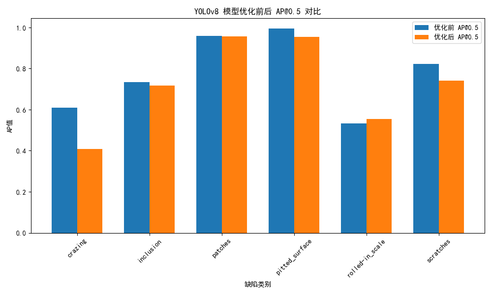
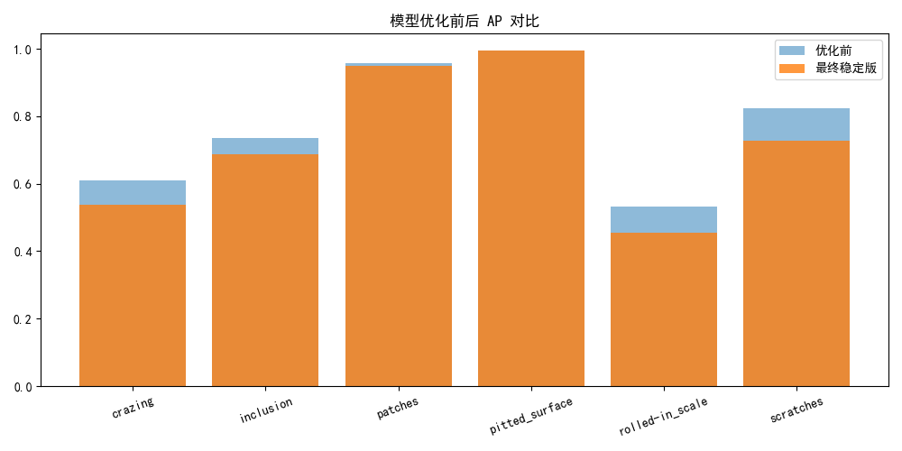
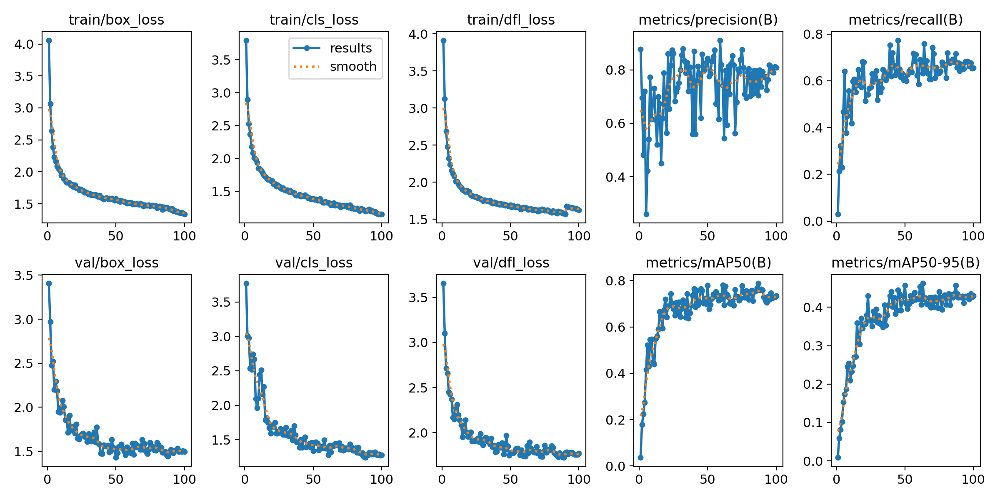
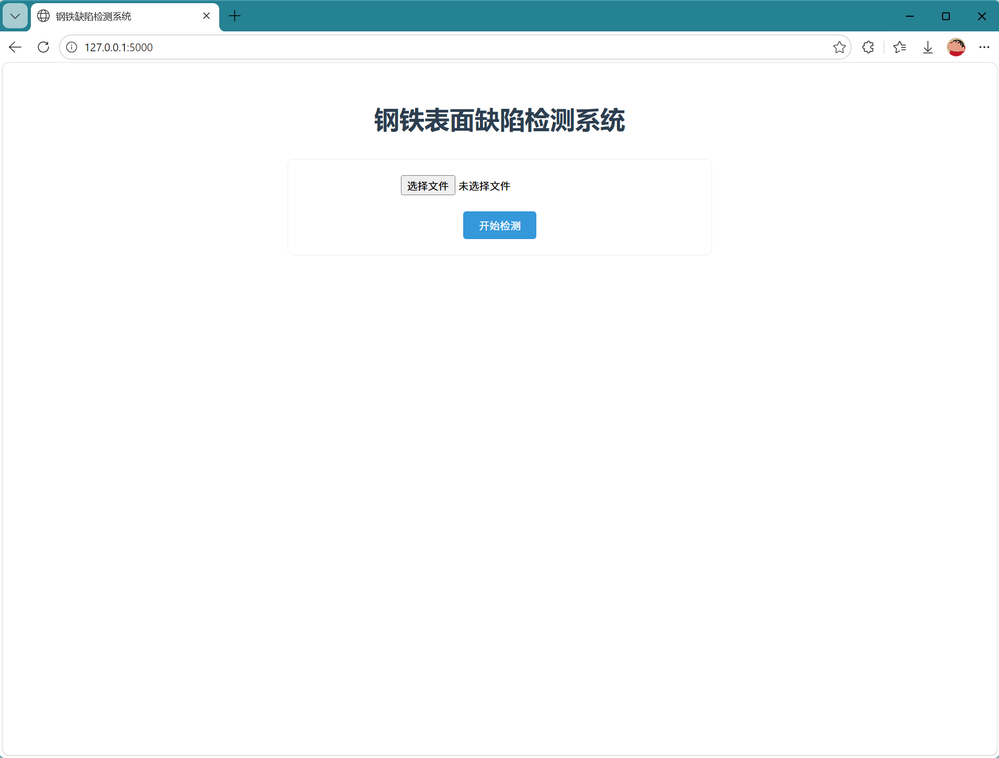
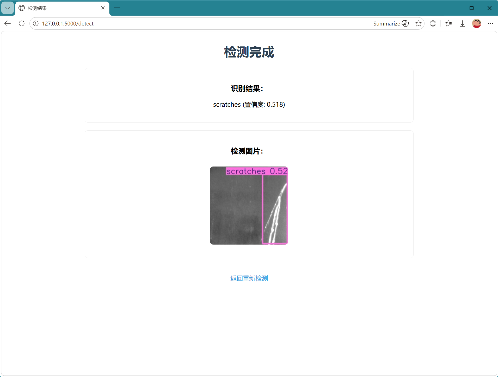

# 基于 YOLOv8 的钢铁表面缺陷检测系统

## 1. 项目简介
本项目基于 YOLOv8 实现**钢铁表面缺陷检测**，完成从数据集准备、模型训练、精度评估、可视化到 Flask Web 部署的**全流程工业视觉项目**。
项目以 NEU-DET 公开数据集为基础，针对工业场景中常见的裂纹、夹杂、氧化皮等难检测缺陷进行优化，并通过多组对比实验分析数据增强对模型性能的影响。

## 2. 数据集说明
- 数据集：NEU-DET 钢铁表面缺陷数据集
- 缺陷类别：6 类
  - crazing（裂纹）
  - inclusion（夹杂）
  - patches（斑块）
  - pitted_surface（点蚀）
  - rolled-in_scale（氧化皮）
  - scratches（划痕）
- 样本数量：共 1800 张，每类 300 张
- 划分方式：训练集 / 验证集 = 8:2

## 3. 模型方案
### 3.1 模型选型
- 模型：YOLOv8s
- 选择理由：速度与精度均衡，适合工业检测场景，部署友好，支持导出 ONNX/TensorRT 便于落地。

### 3.2 训练策略
- 输入尺寸：`imgsz=640`
- 训练轮次：`epochs=50`
- 基础增强：左右翻转、轻度旋转、轻度亮度/饱和度变化
- 训练目标：在保证整体 mAP 稳定的前提下，尽量提升细纹理缺陷的泛化能力

## 4. 实验结果
### 4.1 最终正式模型精度（steel_defect_model7 best.pt）
| 缺陷类别 | AP@0.5 |
|--------|--------|
| crazing | 0.6105 |
| inclusion | 0.7350 |
| patches | 0.9584 |
| pitted_surface | 0.9950 |
| rolled-in_scale | 0.5319 |
| scratches | 0.8223 |
**整体 mAP@0.5：0.7756**

### 4.2 对比实验
为了探索数据增强对缺陷检测的影响，我在正式模型基础上做了两组微调对比：

#### 对比1：较强数据增强（负优化组）
- 增强：旋转 15°、高亮度变化、mosaic=1.0、mixup=0.1
- 结果：**细纹理缺陷（裂纹、划痕）AP 明显下降**
- 结论：过度增强会破坏细长缺陷结构，不适合裂纹类目标

#### 对比2：温和增强（稳定版）
- 增强：旋转 5°、轻度亮度、mosaic=0.5、关闭 mixup
- 结果：整体精度小幅下降，但模型更稳定，无剧烈崩盘
- 结论：温和增强更适合工业缺陷，但对低 AP 类别提升有限

> 综合对比后，**第一版最优模型（model7）综合性能最强**，作为项目最终交付版本。

## 5. 效果展示
### 5.1 精度对比图

> 正式模型与对比1模型

> 正式模型与对比2模型
### 5.2 训练曲线

> 包含：box_loss、cls_loss、mAP@0.5 等曲线

> 
### 5.3 验证结果混淆矩阵 / PR 曲线


### 5.4 实际检测效果示例


## 6. 项目部署
### 6.1 部署方式
- 后端：PyTorch + YOLOv8
- 前端展示：Flask Web 网页部署
- 功能：上传图片 → 自动检测缺陷 → 输出类别与置信度 → 可视化标注框

### 6.2 部署界面截图





## 7. 项目结构
```
steel-defect-detection/
├── README.md               # 项目说明
├── train_stell.py          # 训练代码
├── val_ap.py               # 各类别AP计算脚本
├── app.py                  # Flask部署代码
├── requirements.txt        # 环境依赖
├── data/                   # NEU-DET数据集
├── runs/                   # 训练日志、权重、曲线、图表
└── uploads/                # 网页上传图片缓存
```

## 8. 后续优化方向
1. 对裂纹、氧化皮等低 AP 类别进行**样本加权 / 补充难样本**
2. 引入 Focal Loss 聚焦难分类缺陷
3. 模型导出 ONNX / TensorRT 实现工业端侧部署
4. 接入摄像头实现**实时流水线检测**
5. 增加缺陷统计、报表导出功能

## 9. 项目亮点
- 完整工业视觉全流程：数据 → 训练 → 评估 → 部署
- 有量化指标、对比实验、工程分析，而非单纯跑通模型
- 针对工业缺陷特点设计增强策略，具备实际落地意识
- 可演示、可复现、可扩展
